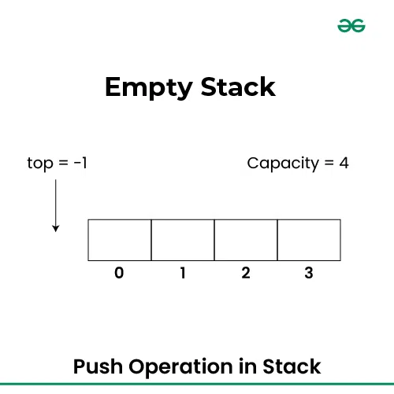
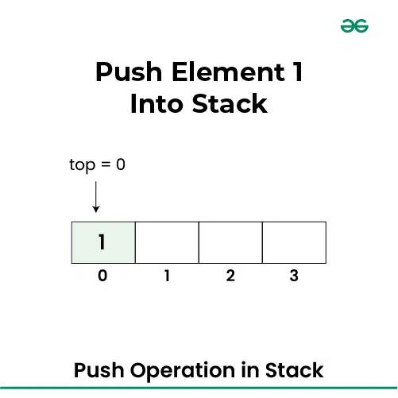
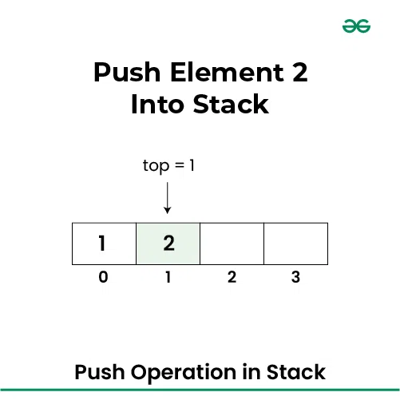

# Stacks

A stack is an ADT that support push, pop and empty operations.
It is a Last-in-First-out data structure (LIFO) - last element to become inserted will be the first to be removed.

A java implementation of Stacks is inside `java.utils.Stack`

A Stack is a list with restrictions

- Insertions and deletions can only be performed at the top of the list

The fundamental operations that occur in a Stack are:

- push() - inserts element at the top.
- pop() - returns the top element while removing it.
- peek() - examines the most recent inserted item.
- isEmpty() - checks to see if a stack is empty.
- isFull() - checks to see if a stack is full.
- popAll() - removes all elements from a stack.

Stacks are less flexible but are easier to implement

A stack is a list with a restriction
Insertions and deletion can only be performed at the top of the list.

## Implementation of Stacks in Array

## Applications of `Stacks`

1. Balancing Symbols
   To check that every right brace, bracket and parenthesis must correspond to its left counterpart.
   eg. [()] is legal, [(] is illegal.

Algorithm:

- Make an empty stack.
- Read characters until end of file.

  i. If the character is an open symbol, push it into the stack.

  ii. If it is a closing symbol, then if the stack is empty report an error

  iii. Otherwise, pop the stack. If the symbol popped is not the corresponding opening symbol then report an error.

- At the end of file, if the stack is not empty, report an error.

2. Postfix Expression
   Is a way of expressing arithmetic expression that avoids the use of brackets to define priorities/precedence for evaluation of operators.

Eg. 4.99 _ 1.06 + 5.99 + 6.99 _ 1.06

To postfix notation it becomes
4.99 1.06 _ 5.99 + 6.99 1.06 _ +
